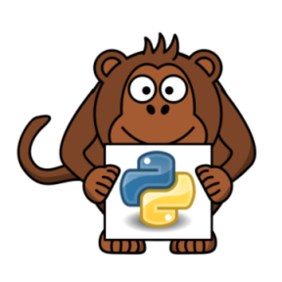

## kofiko - Code-First Configuration approach for Python 

### Overview

*kofiko* = (Ko)de-(Fi)rst (Ko)nfiguration



Define application configuration as Python classes:

```python
@config_section
class GeneralConfig:
    env = "dev"
    port = 8001
    weights = [1.1, 2.2]
    bool_to_str = {
        True: "Yes",
        False: "No"
    }
```

Override default values from either (or both):
1. Customization functions
   ```python
    @config_custom
    def prod():
        GeneralConfig.env = "prod"
        GeneralConfig.port = 8080
    ```

1. `.INI` files:
    ```ini
    [GENERAL]
    bool_to_str = No:Nyet
    WEIGHTS = 3,4,5.1
    ```

1. Environment variables:  
   ```
   myapp_GENERAL_ENV=prod 
   myapp_general_bool_to_str=True:si
   ```

Call to configure:
```python
kofiko.configure()
```

And use configuration classes directly from your code.
```python
print(GeneralConfig.bool_to_str) # 
print(GeneralConfig.bool_to_str) # 
```

No external dependencies. 

### to-do:

* Packaging to pip
* Command-Line arguments layer
  
### License: 
Apache-2.0
